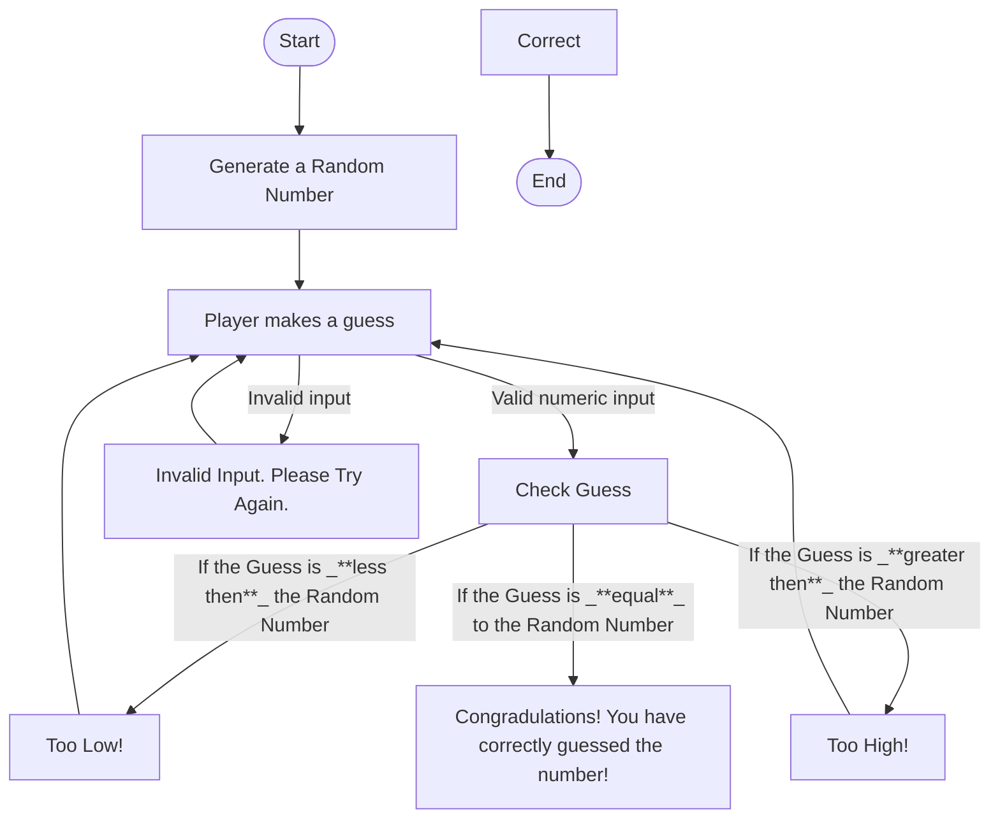

# Random Number Guessing Game!

#### This is my Number Guessing Game that I created where the player makes a guess. The computer will first generate a number which the player will be trying to guess. Once created, it will first check if the numeric input is valid or not. If it's valid, the flowchart continues. If the numeric input is invalid, the player will be asked to try again. 
